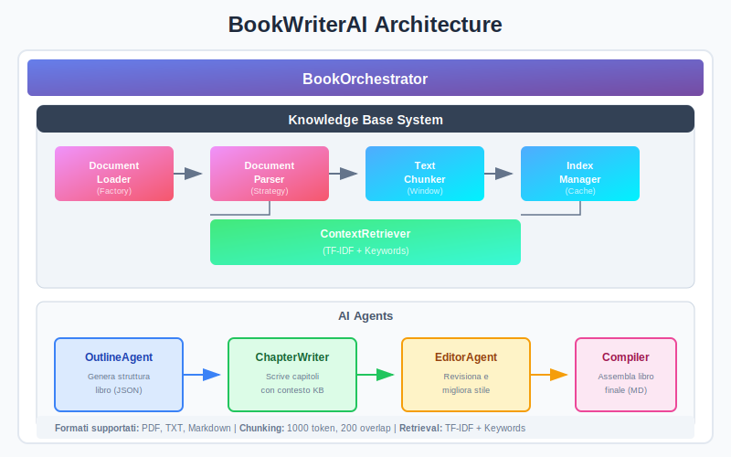

# 📚 BookWriterAI

[](https://www.python.org/downloads/)
[](https://opensource.org/licenses/MIT)
[](https://platform.openai.com/)
[](https://github.com/psf/black)

> **Generazione automatica di libri con sub-agent AI e Knowledge Base Contestuale**

BookWriterAI è un sistema avanzato di generazione di libri che utilizza un'architettura multi-agent per orchestrare la creazione di pubblicazioni complete. Il sistema supporta endpoint OpenAI-compatibili (inclusi OpenAI, DashScope, e altri provider) e include un modulo RAG (Retrieval-Augmented Generation) per arricchire il contenuto con documenti di riferimento.

<p align="center">
  
</p>

---

## 📑 Tabella dei Contenuti

- [Descrizione](#-descrizione)
- [Requisiti di Sistema](#-requisiti-di-sistema)
- [Installazione](#-installazione)
- [Guida Rapida](#-guida-rapida)
- [Funzionalità](#-funzionalità)
- [Struttura del Progetto](#-struttura-del-progetto)
- [Configurazione](#-configurazione)
- [Troubleshooting](#-troubleshooting)
- [Roadmap](#-roadmap)
- [Contributi](#-contributi)
- [Licenza](#-licenza)
- [Credits](#-credits)

---

## 🎯 Descrizione

BookWriterAI automatizza il processo di scrittura di libri attraverso una pipeline di agenti specializzati:

1. **OutlineAgent** - Genera la struttura del libro con titoli, descrizioni e obiettivi
2. **ChapterWriterAgent** - Scrive i singoli capitoli con stile professionale
3. **EditorAgent** - Revisiona e migliora la qualità del testo
4. **CompilerAgent** - Assembla il libro finale in formato Markdown

Il sistema include un **Knowledge Base modulare** che permette di:
- Caricare documenti di riferimento (PDF, TXT, Markdown)
- Estrarre e indicizzare il contenuto
- Recuperare automaticamente il contesto rilevante per ogni capitolo
- Arricchire la generazione con conoscenza specifica del dominio

---

## 💻 Requisiti di Sistema

### Requisiti Minimi

| Componente | Requisito |
|------------|-----------|
| Python | 3.8 o superiore |
| RAM | 4 GB (8 GB consigliati) |
| Spazio disco | 500 MB |
| Connessione | Internet per API AI |

### Requisiti Consigliati

| Componente | Requisito |
|------------|-----------|
| Python | 3.10+ |
| RAM | 16 GB |
| GPU | Non richiesta ma utile per embedding futuri |
| Storage SSD | Per caching veloce |

---

## 🚀 Installazione

### 1. Clonazione Repository

```bash
# Clona il repository
git clone https://github.com/username/BookWriterAI.git
cd BookWriterAI
```

### 2. Setup Ambiente Virtuale

```bash
# Crea ambiente virtuale
python3 -m venv venv

# Attiva ambiente (Linux/Mac)
source venv/bin/activate

# Attiva ambiente (Windows)
venv\Scripts\activate
```

### 3. Installazione Dipendenze

```bash
# Installazione base
pip install -r requirements.txt

# Installazione completa con supporto PDF
pip install -r requirements.txt PyPDF2

# Installazione sviluppo (opzionale)
pip install -e ".[dev]"
```

### 4. Configurazione Variabili d'Ambiente

Crea un file `.env` nella root del progetto:

```bash
# OpenAI API
OPENAI_API_KEY=sk-your-openai-key-here

# Bailian (Alibaba Cloud Coding Plan / OpenClaw)
# Endpoint: https://coding-intl.dashscope.aliyuncs.com/v1
BAILIAN_API_KEY=your-bailian-api-key-here

# Oppure DashScope Legacy (per modelli Qwen con API nativa)
DASHSCOPE_API_KEY=your-dashscope-key-here
```

Oppure esporta le variabili:

```bash
# Linux/Mac
export OPENAI_API_KEY="sk-your-openai-key-here"
export BAILIAN_API_KEY="your-bailian-api-key-here"

# Windows PowerShell
$env:OPENAI_API_KEY="sk-your-openai-key-here"
$env:BAILIAN_API_KEY="your-bailian-api-key-here"
```

---

## ⚡ Guida Rapida

### Generazione Base (Senza Knowledge Base)

```bash
# Genera un libro di 400 pagine sul tema specificato
python ebooks.py \
    --topic "Intelligenza Artificiale e Futuro del Lavoro" \
    --pages 400 \
    --output "mia_pubblicazione.md"
```

### Generazione con Knowledge Base

```bash
# Crea directory per documenti di riferimento
mkdir -p ~/book_context

# Copia i tuoi documenti (PDF, TXT, MD)
cp ~/documenti/riferimento.pdf ~/book_context/
cp ~/documenti/appunti.txt ~/book_context/
cp ~/documenti/bibliografia.md ~/book_context/

# Genera libro con contesto
python ebooks.py \
    --topic "Il Futuro dell'Educazione con l'IA" \
    --pages 400 \
    --context "/home/user/book_context" \
    --provider openai \
    --model "gpt-4" \
    --output "libro_educazione.md"
```

### Utilizzo con Bailian (Coding Plan / OpenClaw) ⭐ Consigliato

```bash
# Esempio con Bailian usando qwen3.5-plus (raccomandato per libri lunghi)
# Vantaggio: 1 milione di token di context window per gestire libri estesi
python ebooks.py \
    --topic "Machine Learning Avanzato" \
    --pages 500 \
    --provider bailian \
    --model "qwen3.5-plus" \
    --context "./knowledge_base"
```

**Perché usare `qwen3.5-plus` per libri lunghi:**
- **1M token di context** = ~750,000 parole = ~1,500 pagine in memoria contemporaneamente
- Mantieni l'intero outline del libro nel contesto per coerenza narrativa perfetta
- Nessuna perdita di informazioni tra capitoli
- Ideale per libri di 300-500+ pagine

### Utilizzo con Endpoint Personalizzati

```bash
# Esempio con endpoint OpenAI-compatibile personalizzato
python ebooks.py \
    --topic "Machine Learning Avanzato" \
    --pages 300 \
    --provider openai \
    --endpoint "https://coding-intl.dashscope.aliyuncs.com/v1" \
    --model "kimi-k2.5" \
    --context "./knowledge_base"
```

### Esempi Avanzati

```bash
# Libro breve con provider Bailian (modelli qwen3.5-plus)
python ebooks.py \
    --topic "Introduzione a Python" \
    --pages 150 \
    --provider bailian \
    --model "qwen3.5-plus"

# Libro con provider Qwen nativo (legacy)
python ebooks.py \
    --topic "Introduzione a Python" \
    --pages 150 \
    --provider qwen \
    --model "qwen-max"

# Generazione con checkpoint (riprende se interrotta)
python ebooks.py \
    --topic "Storia dell'Informatica" \
    --pages 500 \
    --output "storia_informatica.md"
    # I checkpoint sono salvati automaticamente in checkpoints/
```

### Utilizzo della Nuova API Modulare (v2.0)

```python
from src.book_writer import ProfessionalBookWriter, BookConfig

# Configurazione semplificata
config = BookConfig(
    title="Il Mistero della Villa",
    genre="thriller",
    target_length=80000,
    style="commercial",
    enable_refinement=True,
    enable_character_tracking=True
)

# Inizializza il writer
writer = ProfessionalBookWriter(config)

# Genera con tracking progress
def on_progress(progress):
    print(f"[{progress.current_phase}] {progress.progress_percent:.0%} - {progress.message}")

result = writer.generate_book(progress_callback=on_progress)

if result.success:
    print(f"✅ Generato: {result.book.total_word_count} parole")
    
    # Esporta in diversi formati
    writer.export_book(result.book, "markdown", "output/libro.md")
    writer.export_book(result.book, "json", "output/libro.json")
```

#### Generazione Rapida

```python
from src.book_writer import generate_book

# Funzione convenience
result = generate_book(
    title="Romanzo Rapido",
    genre="romance",
    target_length=50000
)
```

#### Utilizzo Componenti Individuali

```python
# Sistema memoria narrativa
from src.narrative import NarrativeStateGraph, NarrativeEvent

narrative = NarrativeStateGraph()
narrative.add_event(NarrativeEvent(
    event_id="event_1",
    event_type="plot_point",
    chapter_id=1,
    description="Il protagonista scopre il segreto"
))

# Knowledge Base RAG
from src.knowledge import KnowledgeBase

kb = KnowledgeBase()
kb.add_document("ricerca.pdf")
context = kb.retrieve("Qual è il movente dell'antagonista?")

# Template per genere
from src.genre import GenreTemplateManager

manager = GenreTemplateManager()
thriller = manager.get_template("thriller")
print(f"Elementi richiesti: {thriller.required_elements}")

# Citazioni accademiche
from src.technical import CitationManager

citations = CitationManager(style="apa")
citations.create_reference(
    reference_type="book",
    title="AI and the Future",
    authors=[{"first_name": "John", "last_name": "Smith"}],
    year=2024
)
```

---

## ✨ Funzionalità

### 🤖 Sistema Multi-Agent

| Agente | Responsabilità | Output |
|--------|---------------|--------|
| `OutlineAgent` | Struttura del libro | JSON con titoli e descrizioni |
| `ChapterWriterAgent` | Scrittura capitoli | Testo markdown per capitolo |
| `EditorAgent` | Revisione e stile | Capitolo migliorato |
| `CompilerAgent` | Assemblaggio finale | Libro completo in Markdown |

**Caratteristiche:**
- Comunicazione asincrona tra agenti
- Checkpoint automatici ogni capitolo
- Retry automatico in caso di errori API
- Memoria del contesto tra capitoli

### 🔌 Supporto Endpoint OpenAI-Compatibili

Supporta qualsiasi provider con API compatibile OpenAI:

| Provider | Tipo | Endpoint | Modelli |
|----------|------|----------|---------|
| **OpenAI** | Nativo | https://api.openai.com/v1 | GPT-4, GPT-3.5-turbo |
| **Bailian** | OpenAI-compatible | https://coding-intl.dashscope.aliyuncs.com/v1 | qwen3.5-plus, kimi-k2.5, etc. |
| **Azure OpenAI** | OpenAI-compatible | https://your-resource.openai.azure.com/ | GPT-4, GPT-3.5 |
| **LocalAI** | OpenAI-compatible | http://localhost:8080/v1 | Modelli locali |
| **Altro** | OpenAI-compatible | Custom | Qualsiasi endpoint `/v1/chat/completions` |

#### Modelli Bailian (Coding Plan / OpenClaw)

| Modello | Context Window | Max Tokens | Input | Ideale per |
|---------|---------------|------------|-------|------------|
| **`qwen3.5-plus`** ⭐ | **1,000,000** | 65,536 | text, image | **Generazione libri lunghi, documenti estesi** |
| `qwen3-max-2026-01-23` | 262,144 | 65,536 | text | Qualità massima |
| `qwen3-coder-next` | 262,144 | 65,536 | text | Codice e tecnico |
| `qwen3-coder-plus` | 1,000,000 | 65,536 | text | Codice e libri tecnici |
| `kimi-k2.5` | 262,144 | 32,768 | text, image | Generale purpose |
| `MiniMax-M2.5` | 196,608 | 32,768 | text | Generale purpose |
| `glm-5` | 202,752 | 16,384 | text | Generale purpose |
| `glm-4.7` | 202,752 | 16,384 | text | Generale purpose |

> **🏆 Modello Consigliato: `qwen3.5-plus`**
>
> Con una **context window di 1 milione di token** (~750,000 parole), `qwen3.5-plus` è il modello ideale per:
> - **Ebook di grandi dimensioni** (500+ pagine)
> - **Analisi di documenti estesi** (interi libri, report aziendali)
> - **Elaborazione di codebase** (progetti software completi)
> - **Conversazioni con memoria estesa** (contesto che persiste per migliaia di messaggi)
>
> **Vantaggio competitivo**: Rispetto a GPT-4 (8K-32K token) o Claude (100K token), `qwen3.5-plus` offre **10-100x più contesto**, eliminando la necessità di frammentare documenti lunghi.

> **Nota**: Il provider `bailian` è raccomandato per l'uso con Alibaba Cloud Coding Plan/OpenClaw. Usa l'endpoint OpenAI-compatible `https://coding-intl.dashscope.aliyuncs.com/v1`.

**Confronto Context Window:**

| Modello | Context Window | Vantaggi | Limitazioni |
|---------|---------------|----------|-------------|
| **qwen3.5-plus** | **1,000,000 token** | ✅ Interi libri in un singolo prompt ✅ Nessuna frammentazione ✅ Coerenza narrativa perfetta | Costo computazionale maggiore per prompt lunghi |
| qwen3-coder-plus | 1,000,000 token | ✅ Ottimo per codice + documentazione | Specializzato per codice |
| kimi-k2.5 | 262,144 token | ✅ Buon equilibrio prestazioni/costo | Richiede chunking per libri lunghi |
| GPT-4 | 8,192-32,768 token | ✅ Alta qualità output | ❌ Necessario frammentare documenti |
| Claude 3 | 200,000 token | ✅ Buon contesto | ❌ Limitato per libri completi |

**Casi d'uso raccomandati per `qwen3.5-plus`:**

1. **Generazione ebook lunghi (>300 pagine)**: Mantieni l'intero outline e i capitoli precedenti in memoria per coerenza narrativa
2. **Analisi documenti aziendali**: Processa report annuali, contratti complessi, documentazione tecnica estesa
3. **Codebase analysis**: Analizza interi repository Git in un singolo prompt
4. **Traduzione libri**: Traduci volumi completi mantenendo terminologia e stile coerenti
5. **Sintesi ricerca**: Elabora centinaia di paper scientifici contemporaneamente

### 📚 Knowledge Base RAG

```
┌─────────────────────────────────────────────────────────┐
│                    Knowledge Base                       │
├─────────────────────────────────────────────────────────┤
│  Document Loader → Parser → Chunker → Index → Retriever │
├─────────────────────────────────────────────────────────┤
│  Formati supportati: PDF, TXT, Markdown                 │
│  Chunking: Intelligente con sovrapposizione             │
│  Retrieval: TF-IDF + Keyword matching                   │
│  Cache: Persistenza automatica in checkpoints/          │
└─────────────────────────────────────────────────────────┘
```

**Flusso di lavoro:**
1. Scansione ricorsiva della directory contestuale
2. Parsing dei documenti con estrazione metadati
3. Chunking intelligente (rispetta confini di paragrafo)
4. Indicizzazione con indice inverso
5. Retrieval automatico per ogni capitolo

### 🧠 Chunking Semantico

- **Dimensione chunk**: Configurabile (default: 1000 token)
- **Sovrapposizione**: 200 token tra chunk consecutivi
- **Boundary detection**: Preferenza per confini di paragrafo
- **Spezzettamento**: A livello di frase per contenuti lunghi

---

## 📁 Struttura del Progetto

```
BookWriterAI/
├── 📄 ebooks.py              # Entry point legacy (monolitico)
├── 📄 generate_book.py       # Entry point v2.0 (API modulare) ⭐
├── 📄 requirements.txt       # Dipendenze Python
├── 📄 README.md             # Questo file
├── 📄 ARCHITECTURE.md       # Documentazione architetturale
├── 📄 LICENSE               # Licenza MIT
├── 📄 .env.example          # Template variabili d'ambiente
│
├── 📁 src/                  # Architettura modulare v2.0
│   ├── 📄 __init__.py       # Package exports
│   ├── 📄 book_writer.py    # API principale
│   ├── 📄 cli.py            # Command Line Interface
│   │
│   ├── 📁 core/             # Infrastruttura core
│   │   ├── exceptions.py    # Gerarchia eccezioni
│   │   ├── config.py        # Gestione configurazione
│   │   ├── llm_client.py    # Client LLM astratto
│   │   └── base_agent.py    # Base agent con mixins
│   │
│   ├── 📁 narrative/        # Sistema memoria narrativa
│   │   ├── events.py        # EventsStore (SQLite)
│   │   ├── entities.py      # EntityRegistry
│   │   ├── relations.py     # RelationsGraph
│   │   ├── context_synthesizer.py
│   │   ├── state_graph.py   # Facade NarrativeStateGraph
│   │   └── emotional_arc.py # Pianificazione emozionale
│   │
│   ├── 📁 knowledge/        # Sistema RAG avanzato
│   │   ├── parsers/         # Parser documenti (PDF, TXT, MD)
│   │   ├── chunker.py       # Text chunking
│   │   ├── embeddings.py    # Multi-vector store
│   │   ├── retrieval.py     # Retrieval gerarchico
│   │   ├── query_rewriter.py
│   │   ├── context_assembler.py
│   │   └── base.py          # Facade KnowledgeBase
│   │
│   ├── 📁 style/            # Motore consistenza stilistica
│   │   ├── profile.py       # Profili di stile
│   │   └── enforcement.py   # Applicazione stile
│   │
│   ├── 📁 refinement/       # Pipeline raffinamento iterativo
│   │   ├── quality.py       # Valutazione qualità
│   │   └── pipeline.py      # Pipeline di raffinamento
│   │
│   ├── 📁 characters/       # Framework sviluppo personaggi
│   │   ├── profile.py       # Profili personaggi
│   │   └── dialogue.py      # Generazione dialoghi
│   │
│   ├── 📁 genre/            # Template per genere
│   │   ├── templates.py     # Template base
│   │   └── genres.py        # Generi specifici
│   │
│   └── 📁 technical/        # Supporto contenuti tecnici
│       ├── citations.py     # Gestione citazioni
│       ├── verification.py  # Verifica fatti
│       └── structure.py     # Struttura accademica
│
├── 📁 tests/                # Test suite
│   ├── test_narrative.py
│   ├── test_genre.py
│   └── test_technical.py
│
├── 📁 checkpoints/          # Checkpoint e cache (auto-generata)
│   ├── state.json          # Stato generazione
│   ├── chapter_001.json    # Capitoli individuali
│   └── kb_cache/           # Cache Knowledge Base
│
└── 📁 examples/             # Esempi di utilizzo
    ├── basic_usage.sh
    └── with_context.sh
```

### Novità v2.0 - Architettura Modulare

La versione 2.0 introduce una completa ristrutturazione architetturale:

| Sistema | Descrizione | Componenti |
|---------|-------------|------------|
| **Narrative Memory** | Memoria a lungo termine per coerenza narrativa | EventsStore, EntityRegistry, RelationsGraph |
| **Advanced RAG** | Retrieval semantico multi-vettoriale | MultiVectorStore, HierarchicalRetriever |
| **Style Engine** | Consistenza stilistica automatica | StyleProfile, StyleValidator, StyleCorrector |
| **Refinement Pipeline** | Miglioramento iterativo della qualità | QualityAssessor, ProseRefiner |
| **Character Framework** | Sviluppo e consistenza personaggi | CharacterProfile, DialogueGenerator |
| **Genre Templates** | Template specifici per genere | Thriller, Romance, Fantasy, Mystery, etc. |
| **Technical Support** | Supporto contenuti accademici/tecnici | CitationManager, FactVerification |

---

## ⚙️ Configurazione

### Parametri CLI

| Parametro | Tipo | Default | Descrizione |
|-----------|------|---------|-------------|
| `--topic` | str | "Intelligenza artificiale..." | Tema del libro |
| `--pages` | int | 400 | Numero pagine target |
| `--output` | str | "book_output.md" | File output |
| `--context` | str | None | Path Knowledge Base |
| `--provider` | choice | "openai" | Provider AI (`openai`, `bailian`, `qwen`) |
| `--model` | str | "gpt-4" | Modello specifico (vedi tabella modelli) |
| `--endpoint` | str | None | URL endpoint personalizzato (solo provider `openai`) |

#### Provider Disponibili

- **`openai`**: API OpenAI nativa o endpoint compatibile personalizzato
- **`bailian`**: Alibaba Cloud Coding Plan/OpenClaw (raccomandato, endpoint OpenAI-compatible)
- **`qwen`**: DashScope API nativa (legacy, per retrocompatibilità)

#### Modelli per Provider

**OpenAI:**
- `gpt-4`, `gpt-4-turbo`, `gpt-3.5-turbo`

**Bailian (Coding Plan):**
- **`qwen3.5-plus`** ⭐ (default, raccomandato per libri lunghi - 1M token context window)
- `qwen3-max-2026-01-23`, `qwen3-coder-next`, `qwen3-coder-plus`
- `kimi-k2.5`, `MiniMax-M2.5`, `glm-5`, `glm-4.7`

> 💡 **Suggerimento**: Per libri di 300+ pagine, usa sempre `qwen3.5-plus` per sfruttare la context window di 1 milione di token.

**Qwen (Legacy):**
- `qwen-max`, `qwen-plus`, `qwen-turbo`

### Configurazione Avanzata (in codice)

```python
from ebooks import Config

config = Config(
    topic="Il mio libro",
    target_pages=400,
    context_path="./knowledge",
    chunk_size=1000,          # Token per chunk
    chunk_overlap=200,        # Sovrapposizione
    max_context_chunks=5,     # Chunk in prompt
    temperature=0.7,          # Creatività
    max_tokens_per_call=2000  # Limite risposta
)
```

---

## 🔧 Troubleshooting

### Problemi Comuni

#### Errore: "API key non trovata"

```
ValueError: API key non trovata. Imposta OPENAI_API_KEY, BAILIAN_API_KEY o DASHSCOPE_API_KEY nel .env
```

**Soluzione:**
```bash
# Verifica che il file .env esista
cat .env

# Oppure esporta direttamente
export OPENAI_API_KEY="sk-..."
export BAILIAN_API_KEY="your-bailian-api-key-here"
```

#### Errore: "HTTP 401: Incorrect API key provided" (Bailian)

**Cause possibili:**
1. La chiave API potrebbe essere non valida, scaduta o formattata incorrettamente
2. La chiave non corrisponde all'endpoint specificato
3. La sottoscrizione potrebbe non essere attiva

**Soluzione:**
```bash
# Verifica che stai usando la chiave corretta per Coding Plan
# Ottieni una nuova chiave da: https://dashscope.aliyun.com/

# Se usi DASHSCOPE_API_KEY come fallback per bailian, verifica che sia valida
export BAILIAN_API_KEY="your-coding-plan-api-key-here"
```

#### Errore: "PyPDF2 non installato"

```
Warning: PyPDF2 non installato. Supporto PDF disabilitato.
```

**Soluzione:**
```bash
pip install PyPDF2
```

#### Errore: "Nessun testo estratto dal PDF"

Il PDF potrebbe essere:
- Scansionato (immagini)
- Corrotto
- Protetto da password

**Soluzione:** Usa OCR (es. `ocrmypdf`) prima di importare.

#### Errore: "Impossibile decodificare il file"

**Soluzione:** Converti il file in UTF-8:
```bash
iconv -f ISO-8859-1 -t UTF-8 input.txt > output.txt
```

#### Generazione interrotta

**Soluzione:** Il sistema salva automaticamente i checkpoint. Rilancia lo stesso comando per riprendere.

### Debug Mode

```bash
# Abilita logging dettagliato
export LOG_LEVEL=DEBUG
python ebooks.py --topic "Test" --pages 10
```

---

## 🗺️ Roadmap

### v1.1 (Prossimo)
- [ ] Supporto DOCX per input/output
- [ ] Embedding semantici con sentence-transformers
- [ ] Interfaccia web per configurazione
- [ ] Esportazione EPUB e PDF

### v1.2 (Futuro)
- [ ] Multi-language support
- [ ] Agenti specializzati per generi letterari
- [ ] Integrazione con Wikipedia/API esterne
- [ ] Valutazione automatica qualità

### v2.0 (Visione)
- [ ] Fine-tuning modelli locali
- [ ] Generazione immagini con DALL-E/Stable Diffusion
- [ ] Collaborative writing (multi-utente)
- [ ] Plugin system per estensioni

---

## 🤝 Contributi

Contributi sono benvenuti! Segui questi passaggi:

### Setup Sviluppo

```bash
# Fork e clone
git clone https://github.com/tuo-username/BookWriterAI.git
cd BookWriterAI

# Setup ambiente dev
python -m venv venv
source venv/bin/activate
pip install -r requirements.txt
pip install black flake8 pytest

# Crea branch
git checkout -b feature/mia-feature
```

### Linee Guida

1. **Code Style**: Usa `black` per formattazione
   ```bash
   black ebooks.py
   ```

2. **Type Hints**: Aggiungi annotazioni di tipo

3. **Documentazione**: Aggiorna docstring e README

4. **Test**: Scrivi test per nuove funzionalità
   ```bash
   pytest tests/
   ```

### Pull Request

1. Assicurati che i test passino
2. Aggiorna la documentazione
3. Descrivi chiaramente le modifiche
4. Linka eventuali issue correlate

---

## 📄 Licenza

Questo progetto è rilasciato sotto licenza **MIT**.

```
MIT License

Copyright (c) 2024 BookWriterAI Contributors

Permission is hereby granted, free of charge, to any person obtaining a copy
of this software and associated documentation files (the "Software"), to deal
in the Software without restriction, including without limitation the rights
to use, copy, modify, merge, publish, distribute, sublicense, and/or sell
copies of the Software, and to permit persons to whom the Software is
furnished to do so, subject to the following conditions:

The above copyright notice and this permission notice shall be included in all
copies or substantial portions of the Software.

THE SOFTWARE IS PROVIDED "AS IS", WITHOUT WARRANTY OF ANY KIND, EXPRESS OR
IMPLIED, INCLUDING BUT NOT LIMITED TO THE WARRANTIES OF MERCHANTABILITY,
FITNESS FOR A PARTICULAR PURPOSE AND NONINFRINGEMENT.
```

Vedi il file [LICENSE](LICENSE) per il testo completo.

---

## 🙏 Credits

### Autore Originale

**BookWriterAI** è stato creato da **[Emilio Petrozzi](https://www.mrtux.it)** come progetto open-source per esplorare le potenzialità dei Large Language Models nella generazione di contenuti editoriali.

🌐 **Website**: [https://www.mrtux.it](https://www.mrtux.it)

### Contributori

Grazie a tutti i contributori che hanno reso questo progetto possibile.

Vuoi contribuire? Vedi la sezione [Contributi](#-contributi) per iniziare!

### Tecnologie Utilizzate

- [OpenAI](https://openai.com/) - API GPT
- [Bailian](https://dashscope.aliyun.com/) - Alibaba Cloud Coding Plan/OpenClaw
- [DashScope](https://dashscope.aliyun.com/) - API Qwen (legacy)
- [PyPDF2](https://pypi.org/project/PyPDF2/) - Parsing PDF
- [TikToken](https://github.com/openai/tiktoken) - Tokenizzazione

### Ispirazioni

- [LangChain](https://langchain.com/) - Framework LLM
- [AutoGPT](https://github.com/Significant-Gravitas/AutoGPT) - Agenti autonomi
- [RAGFlow](https://github.com/infiniflow/ragflow) - Sistemi RAG

---

<p align="center">
  <strong>⭐ Star questo repo se ti è utile! ⭐</strong>
</p>

<p align="center">
  <a href="https://github.com/username/BookWriterAI/issues">Report Bug</a> •
  <a href="https://github.com/username/BookWriterAI/issues">Request Feature</a> •
  <a href="https://github.com/username/BookWriterAI/discussions">Discussions</a>
</p>
