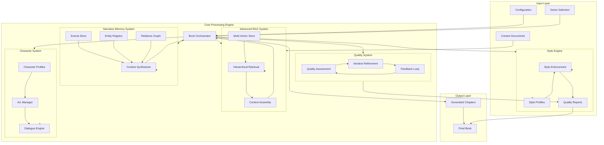

# Architectural Evolution Proposal: BookWriterAI Professional Platform

## Executive Summary

This proposal outlines a comprehensive architectural evolution to transform the current BookWriterAI script into a professional-grade automated writing platform capable of generating books with literary quality, emotional depth, and structural coherence comparable to best-selling authors.

### Current State Analysis

**Strengths:**
- Multi-layered content expansion with recursive section generation
- Basic RAG system with TF-IDF retrieval
- Adaptive token budgeting based on chapter complexity
- Progressive outline enrichment in 3 phases
- Content validation with regeneration triggers
- Checkpoint-based resilience

**Critical Gaps:**
- No long-term narrative memory or plot consistency tracking
- No character development or relationship management
- No stylistic consistency enforcement
- Limited RAG capabilities (keyword-based only)
- Single-pass refinement without iterative improvement
- No genre-specific templates or conventions
- No emotional arc planning or pacing control
- Limited scientific/technical content support

---

## 1. Long-Term Narrative Memory System

### Problem Statement
The current system generates each chapter with limited context from previous chapters (only the last 500 characters of the previous chapter summary). This leads to:
- Plot inconsistencies and forgotten storylines
- Contradictions in timeline and events
- Lost narrative threads and unresolved subplots
- Character actions that contradict earlier behavior

### Proposed Architecture

```
┌─────────────────────────────────────────────────────────────────────────────┐
│                     LONG-TERM NARRATIVE MEMORY SYSTEM                       │
├─────────────────────────────────────────────────────────────────────────────┤
│                                                                             │
│  ┌───────────────────────────────────────────────────────────────────────┐  │
│  │                      NarrativeStateGraph                               │  │
│  │  ┌─────────────┐   ┌─────────────┐   ┌─────────────┐   ┌───────────┐ │  │
│  │  │   Events    │──▶│  Entities   │──▶│ Relations   │──▶│  States   │ │  │
│  │  │   Store     │   │   Registry  │   │   Graph     │   │  Timeline │ │  │
│  │  └─────────────┘   └─────────────┘   └─────────────┘   └───────────┘ │  │
│  └───────────────────────────────────────────────────────────────────────┘  │
│                                    │                                        │
│                                    ▼                                        │
│  ┌───────────────────────────────────────────────────────────────────────┐  │
│  │                      Context Synthesizer                               │  │
│  │  ┌─────────────┐   ┌─────────────┐   ┌─────────────┐   ┌───────────┐ │  │
│  │  │   Plot      │   │  Timeline   │   │  Unresolved │   │  Relevant │ │  │
│  │  │  Summarizer │   │  Compiler   │   │   Threads   │   │  Context  │ │  │
│  │  └─────────────┘   └─────────────┘   └─────────────┘   └───────────┘ │  │
│  └───────────────────────────────────────────────────────────────────────┘  │
│                                                                             │
└─────────────────────────────────────────────────────────────────────────────┘
```

### Core Components

#### 1.1 Events Store
```python
@dataclass
class NarrativeEvent:
    """Represents a significant event in the narrative."""
    event_id: str
    event_type: str  # plot_point, character_action, revelation, conflict, resolution
    chapter_id: int
    timestamp: str  # narrative time
    description: str
    entities_involved: List[str]  # entity IDs
    consequences: List[str]  # event IDs of consequences
    emotional_valence: float  # -1.0 to 1.0
    importance_weight: float  # 0.0 to 1.0
    foreshadowing_refs: List[str]  # event IDs this foreshadows
    resolution_refs: List[str]  # event IDs this resolves

class EventsStore:
    """Persistent storage for narrative events with semantic indexing."""
    
    def add_event(self, event: NarrativeEvent) -> str: ...
    def get_events_by_chapter(self, chapter_id: int) -> List[NarrativeEvent]: ...
    def get_unresolved_events(self) -> List[NarrativeEvent]: ...
    def get_events_by_entity(self, entity_id: str) -> List[NarrativeEvent]: ...
    def find_foreshadowing_opportunities(self) -> List[NarrativeEvent]: ...
```

#### 1.2 Entity Registry
```python
@dataclass
class Entity:
    """Base class for all narrative entities."""
    entity_id: str
    entity_type: str  # character, location, object, concept, organization
    name: str
    aliases: List[str]
    first_appearance: int  # chapter_id
    last_mention: int  # chapter_id
    attributes: Dict[str, Any]
    state_history: List[EntityState]

@dataclass
class EntityState:
    """Snapshot of entity state at a point in narrative time."""
    chapter_id: int
    timestamp: str
    state_type: str  # physical, emotional, relational, knowledge
    attributes: Dict[str, Any]
    changed_by_event: str  # event_id

class EntityRegistry:
    """Central registry for all narrative entities."""
    
    def register_entity(self, entity: Entity) -> str: ...
    def get_entity(self, entity_id: str) -> Optional[Entity]: ...
    def get_entity_state_at(self, entity_id: str, chapter_id: int) -> EntityState: ...
    def update_entity_state(self, entity_id: str, state: EntityState) -> None: ...
    def find_entities_by_type(self, entity_type: str) -> List[Entity]: ...
```

#### 1.3 Relations Graph
```python
@dataclass
class Relation:
    """Represents a relationship between entities."""
    relation_id: str
    source_entity: str
    target_entity: str
    relation_type: str  # family, friend, enemy, knows, owns, located_at
    strength: float  # 0.0 to 1.0
    sentiment: float  # -1.0 to 1.0
    established_chapter: int
    last_updated_chapter: int
    history: List[RelationState]

class RelationsGraph:
    """Graph-based relationship management."""
    
    def add_relation(self, relation: Relation) -> str: ...
    def get_relations(self, entity_id: str) -> List[Relation]: ...
    def get_relation_between(self, entity_a: str, entity_b: str) -> Optional[Relation]: ...
    def update_relation(self, relation_id: str, new_state: RelationState) -> None: ...
    def get_social_network(self, entity_id: str, depth: int = 2) -> Dict[str, List[Relation]]: ...
```

#### 1.4 Context Synthesizer
```python
class ContextSynthesizer:
    """
    Synthesizes relevant context for chapter generation.
    Implements relevance scoring and context window optimization.
    """
    
    def synthesize_context(
        self,
        current_chapter: int,
        chapter_info: Dict,
        max_tokens: int
    ) -> NarrativeContext:
        """
        Produces optimized context for generation.
        
        Returns:
            NarrativeContext containing:
            - relevant_events: List of events that should be referenced
            - active_entities: Current state of involved entities
            - active_relations: Current relationship states
            - unresolved_threads: Plot threads that need attention
            - timeline_context: Relevant temporal information
        """
        pass
```

### Implementation Strategy

1. **Phase 1**: Implement core data structures with SQLite persistence
2. **Phase 2**: Add semantic search using embeddings for event retrieval
3. **Phase 3**: Integrate with chapter generation pipeline
4. **Phase 4**: Add automatic extraction from generated content

---

## 2. Character Development Framework

### Problem Statement
Characters are generated without consistent development:
- No character arcs or growth tracking
- Inconsistent personality traits and motivations
- Static relationships that do not evolve
- Dialogue that does not reflect character voice

### Proposed Architecture

```
┌─────────────────────────────────────────────────────────────────────────────┐
│                     CHARACTER DEVELOPMENT FRAMEWORK                         │
├─────────────────────────────────────────────────────────────────────────────┤
│                                                                             │
│  ┌───────────────────────────────────────────────────────────────────────┐  │
│  │                      Character Profile System                          │  │
│  │  ┌─────────────┐   ┌─────────────┐   ┌─────────────┐   ┌───────────┐ │  │
│  │  │  Personality │   │  Motivation │   │    Voice    │   │  Arc      │ │  │
│  │  │   Profile    │   │   System    │   │   Profile   │   │  Manager  │ │  │
│  │  └─────────────┘   └─────────────┘   └─────────────┘   └───────────┘ │  │
│  └───────────────────────────────────────────────────────────────────────┘  │
│                                    │                                        │
│                                    ▼                                        │
│  ┌───────────────────────────────────────────────────────────────────────┐  │
│  │                      Character Interaction Engine                      │  │
│  │  ┌─────────────┐   ┌─────────────┐   ┌─────────────┐   ┌───────────┐ │  │
│  │  │  Dialogue   │   │  Conflict   │   │ Relationship│   │  Dynamic  │ │  │
│  │  │  Generator  │   │  Resolver   │   │  Dynamics   │   │  Tracking │ │  │
│  │  └─────────────┘   └─────────────┘   └─────────────┘   └───────────┘ │  │
│  └───────────────────────────────────────────────────────────────────────┘  │
│                                                                             │
└─────────────────────────────────────────────────────────────────────────────┘
```

### Core Components

#### 2.1 Character Profile System

```python
@dataclass
class PersonalityProfile:
    """Comprehensive personality model based on Big Five + narrative traits."""
    # Big Five traits
    openness: float  # 0.0 to 1.0
    conscientiousness: float
    extraversion: float
    agreeableness: float
    neuroticism: float
    
    # Narrative-specific traits
    moral_alignment: str  # lawful_good, chaotic_neutral, etc.
    primary_drives: List[str]  # power, love, knowledge, freedom, etc.
    fears: List[str]
    secrets: List[str]
    flaws: List[str]
    strengths: List[str]
    
    # Behavioral patterns
    speech_patterns: SpeechPatterns
    decision_making_style: str  # analytical, emotional, impulsive
    conflict_style: str  # confrontational, avoidant, collaborative

@dataclass
class SpeechPatterns:
    """Defines character voice and dialogue patterns."""
    vocabulary_level: str  # simple, moderate, sophisticated, academic
    sentence_structure: str  # short, complex, poetic
    common_phrases: List[str]
    verbal_tics: List[str]  # words or phrases frequently used
    emotional_expressiveness: float  # 0.0 to 1.0
    formality: float  # 0.0 to 1.0
    humor_style: Optional[str]  # witty, dry, slapstick, sarcastic

@dataclass
class CharacterArc:
    """Manages character development trajectory."""
    character_id: str
    arc_type: str  # growth, fall, flat, transformation
    starting_state: CharacterState
    target_state: CharacterState
    key_moments: List[ArcMoment]
    current_progress: float  # 0.0 to 1.0

@dataclass
class ArcMoment:
    """A significant moment in character development."""
    chapter_id: int
    moment_type: str  # catalyst, challenge, revelation, turning_point, climax
    description: str
    state_change: Dict[str, Any]  # what changes in the character
    trigger_event: str  # event_id
```

#### 2.2 Character Interaction Engine

```python
class DialogueGenerator:
    """Generates character-appropriate dialogue."""
    
    def __init__(self, character_profiles: Dict[str, PersonalityProfile]):
        self.profiles = character_profiles
    
    def generate_dialogue(
        self,
        speaker_id: str,
        listener_ids: List[str],
        context: str,
        emotional_state: str,
        intent: str
    ) -> str:
        """
        Generates dialogue that reflects:
        - Speaker's personality and voice
        - Relationship dynamics with listeners
        - Current emotional state
        - Communication intent
        """
        pass
    
    def generate_internal_monologue(
        self,
        character_id: str,
        situation: str,
        hidden_thoughts: bool = True
    ) -> str:
        """Generates internal thoughts reflecting character's inner world."""
        pass

class RelationshipDynamics:
    """Manages evolving relationships between characters."""
    
    def calculate_interaction_dynamics(
        self,
        character_a: str,
        character_b: str,
        context: NarrativeContext
    ) -> InteractionDynamics:
        """
        Calculates how two characters should interact based on:
        - Relationship history
        - Current emotional states
        - Recent events between them
        - Power dynamics
        - Hidden agendas
        """
        pass
```

### Character Consistency Validation

```python
class CharacterConsistencyValidator:
    """Validates character behavior consistency."""
    
    def validate_action(
        self,
        character_id: str,
        action: str,
        context: NarrativeContext
    ) -> ConsistencyReport:
        """
        Validates if an action is consistent with character profile.
        
        Returns:
            ConsistencyReport containing:
            - is_consistent: bool
            - consistency_score: float
            - violations: List of trait violations
            - suggested_modifications: List of alternative actions
        """
        pass
    
    def validate_dialogue(
        self,
        character_id: str,
        dialogue: str
    ) -> DialogueConsistencyReport:
        """Validates dialogue matches character voice and patterns."""
        pass
```

---

## 3. Stylistic Consistency Engine

### Problem Statement
Generated content lacks stylistic coherence:
- Inconsistent tone and voice across chapters
- Varying sentence complexity and vocabulary
- Inconsistent narrative perspective
- Genre conventions not consistently applied

### Proposed Architecture

```
┌─────────────────────────────────────────────────────────────────────────────┐
│                     STYLISTIC CONSISTENCY ENGINE                            │
├─────────────────────────────────────────────────────────────────────────────┤
│                                                                             │
│  ┌───────────────────────────────────────────────────────────────────────┐  │
│  │                      Style Profile Manager                             │  │
│  │  ┌─────────────┐   ┌─────────────┐   ┌─────────────┐   ┌───────────┐ │  │
│  │  │    Voice    │   │    Tone     │   │   Lexical   │   │ Syntactic │ │  │
│  │  │   Profile   │   │   Profile   │   │   Profile   │   │  Profile  │ │  │
│  │  └─────────────┘   └─────────────┘   └─────────────┘   └───────────┘ │  │
│  └───────────────────────────────────────────────────────────────────────┘  │
│                                    │                                        │
│                                    ▼                                        │
│  ┌───────────────────────────────────────────────────────────────────────┐  │
│  │                      Style Enforcement Layer                           │  │
│  │  ┌─────────────┐   ┌─────────────┐   ┌─────────────┐   ┌───────────┐ │  │
│  │  │   Prompt    │   │   Output    │   │   Style     │   │  Genre    │ │  │
│  │  │  Injection  │   │  Validator  │   │  Corrector  │   │ Conventions│ │  │
│  │  └─────────────┘   └─────────────┘   └─────────────┘   └───────────┘ │  │
│  └───────────────────────────────────────────────────────────────────────┘  │
│                                                                             │
└─────────────────────────────────────────────────────────────────────────────┘
```

### Core Components

#### 3.1 Style Profile System

```python
@dataclass
class StyleProfile:
    """Comprehensive style definition for generated content."""
    
    # Voice characteristics
    narrative_voice: str  # first_person, third_limited, third_omniscient
    narrator_personality: Optional[str]  # for distinct narrator voice
    authorial_voice: str  # invisible, prominent, intrusive
    
    # Tone characteristics
    primary_tone: str  # serious, humorous, melancholic, hopeful
    tone_variation: float  # 0.0 to 1.0, how much tone can vary
    emotional_range: Tuple[float, float]  # min and max emotional intensity
    
    # Lexical characteristics
    vocabulary_complexity: str  # simple, moderate, sophisticated
    jargon_level: float  # 0.0 to 1.0
    figurative_language_density: float  # metaphors, similes per 1000 words
    sensory_language_ratio: float  # sensory details ratio
    
    # Syntactic characteristics
    average_sentence_length: int  # target words per sentence
    sentence_length_variation: float  # standard deviation
    paragraph_length: int  # target sentences per paragraph
    dialogue_narration_ratio: float  # target ratio
    
    # Rhythm and pacing
    scene_break_frequency: int  # scenes per chapter
    cliffhanger_probability: float  # chapter endings
    description_action_balance: float  # 0.0 = all action, 1.0 = all description

class StyleProfileManager:
    """Manages style profiles and their application."""
    
    def create_profile_from_examples(
        self,
        example_texts: List[str]
    ) -> StyleProfile:
        """Analyzes example texts to create a style profile."""
        pass
    
    def create_genre_profile(
        self,
        genre: str,
        subgenre: Optional[str] = None
    ) -> StyleProfile:
        """Creates a style profile based on genre conventions."""
        pass
    
    def merge_profiles(
        self,
        base_profile: StyleProfile,
        override_profile: StyleProfile,
        merge_weights: Dict[str, float]
    ) -> StyleProfile:
        """Merges two profiles with weighted preferences."""
        pass
```

#### 3.2 Style Enforcement Layer

```python
class StylePromptInjector:
    """Injects style requirements into generation prompts."""
    
    def create_style_prompt(
        self,
        style_profile: StyleProfile,
        content_type: str,  # narration, dialogue, description, action
        context: str
    ) -> str:
        """
        Creates a detailed style instruction prompt.
        
        Example output:
        ---
        STYLE REQUIREMENTS:
        - Narrative voice: Third-person limited from protagonist's perspective
        - Tone: Melancholic with moments of hope
        - Vocabulary: Sophisticated, literary
        - Sentence structure: Varied, with tendency toward complex sentences
        - Figurative language: Include 2-3 metaphors per paragraph
        - Sensory details: Emphasize visual and auditory imagery
        - Pacing: Slow, contemplative with occasional bursts of action
        ---
        """
        pass

class StyleValidator:
    """Validates generated content against style profile."""
    
    def validate(
        self,
        text: str,
        style_profile: StyleProfile
    ) -> StyleValidationReport:
        """
        Analyzes text for style compliance.
        
        Returns metrics on:
        - Sentence length distribution
        - Vocabulary complexity
        - Figurative language density
        - Dialogue/narration ratio
        - Tone consistency
        - Perspective consistency
        """
        pass

class StyleCorrector:
    """Applies corrections to bring content closer to style profile."""
    
    def correct(
        self,
        text: str,
        style_profile: StyleProfile,
        validation_report: StyleValidationReport
    ) -> str:
        """
        Applies targeted corrections:
        - Sentence length adjustment
        - Vocabulary substitution
        - Tone adjustment
        - Perspective correction
        """
        pass
```

---

## 4. Advanced RAG Architecture

### Problem Statement
Current RAG system limitations:
- Keyword-based TF-IDF retrieval only
- No semantic understanding of content
- No hierarchical document structure awareness
- Limited to external documents, not generated content

### Proposed Architecture

```
┌─────────────────────────────────────────────────────────────────────────────┐
│                     ADVANCED RAG ARCHITECTURE                               │
├─────────────────────────────────────────────────────────────────────────────┤
│                                                                             │
│  ┌───────────────────────────────────────────────────────────────────────┐  │
│  │                      Multi-Vector Store System                         │  │
│  │  ┌─────────────┐   ┌─────────────┐   ┌─────────────┐   ┌───────────┐ │  │
│  │  │  Document   │   │  Narrative  │   │   Entity    │   │   Style   │ │  │
│  │  │  Embeddings │   │  Embeddings │   │  Embeddings │   │ Embeddings│ │  │
│  │  └─────────────┘   └─────────────┘   └─────────────┘   └───────────┘ │  │
│  └───────────────────────────────────────────────────────────────────────┘  │
│                                    │                                        │
│                                    ▼                                        │
│  ┌───────────────────────────────────────────────────────────────────────┐  │
│  │                      Hierarchical Retrieval System                     │  │
│  │  ┌─────────────┐   ┌─────────────┐   ┌─────────────┐   ┌───────────┐ │  │
│  │  │   Query     │   │  Contextual │   │   Hybrid    │   │  Reranker │ │  │
│  │  │  Rewriter   │   │  Retrieval  │   │   Search    │   │           │ │  │
│  │  └─────────────┘   └─────────────┘   └─────────────┘   └───────────┘ │  │
│  └───────────────────────────────────────────────────────────────────────┘  │
│                                    │                                        │
│                                    ▼                                        │
│  ┌───────────────────────────────────────────────────────────────────────┐  │
│  │                      Context Assembly Engine                           │  │
│  │  ┌─────────────┐   ┌─────────────┐   ┌─────────────┐   ┌───────────┐ │  │
│  │  │   Context   │   │  Relevance  │   │   Context   │   │  Context  │ │  │
│  │  │  Selector   │   │   Scorer    │   │  Compressor │   │  Formatter│ │  │
│  │  └─────────────┘   └─────────────┘   └─────────────┘   └───────────┘ │  │
│  └───────────────────────────────────────────────────────────────────────┘  │
│                                                                             │
└─────────────────────────────────────────────────────────────────────────────┘
```

### Core Components

#### 4.1 Multi-Vector Store System

```python
class MultiVectorStore:
    """
    Manages multiple embedding types for different content aspects.
    Supports both external documents and generated content.
    """
    
    def __init__(self, embedding_models: Dict[str, EmbeddingModel]):
        self.stores = {
            "semantic": VectorStore(embedding_models["semantic"]),  # General meaning
            "narrative": VectorStore(embedding_models["narrative"]),  # Plot/events
            "entity": VectorStore(embedding_models["entity"]),  # Characters/locations
            "style": VectorStore(embedding_models["style"]),  # Writing style
        }
    
    def index_content(
        self,
        content: str,
        content_type: str,  # document, chapter, character, event
        metadata: Dict[str, Any]
    ) -> None:
        """Indexes content across all relevant vector stores."""
        pass
    
    def hybrid_search(
        self,
        query: str,
        stores: List[str],
        weights: Dict[str, float],
        top_k: int = 10
    ) -> List[RetrievalResult]:
        """
        Performs weighted hybrid search across multiple stores.
        
        Example:
            hybrid_search(
                query="How does the protagonist feel about the antagonist?",
                stores=["narrative", "entity", "semantic"],
                weights={"narrative": 0.4, "entity": 0.4, "semantic": 0.2}
            )
        """
        pass
```

#### 4.2 Hierarchical Retrieval System

```python
class HierarchicalRetriever:
    """
    Implements hierarchical retrieval for long-form content.
    Book → Chapter → Section → Paragraph
    """
    
    def retrieve_with_context(
        self,
        query: str,
        max_tokens: int
    ) -> HierarchicalContext:
        """
        Retrieves relevant content with proper hierarchical context.
        
        Returns:
            HierarchicalContext containing:
            - book_context: High-level book summary
            - chapter_contexts: Relevant chapter summaries
            - section_contexts: Relevant section summaries
            - detailed_content: Specific paragraphs/passages
        """
        pass

class QueryRewriter:
    """Rewrites queries for better retrieval."""
    
    def rewrite_for_retrieval(
        self,
        original_query: str,
        context: NarrativeContext
    ) -> List[str]:
        """
        Generates multiple query variations for better retrieval.
        
        Example:
            Original: "What happened to John?"
            Rewritten:
            - "John character arc events"
            - "John major plot points"
            - "John relationships changes"
            - "John emotional journey"
        """
        pass

class ContextualRetriever:
    """Retrieves content considering narrative context."""
    
    def retrieve_for_chapter(
        self,
        chapter_info: Dict,
        narrative_state: NarrativeState,
        max_tokens: int
    ) -> RetrievalContext:
        """
        Retrieves context specifically for chapter generation.
        
        Considers:
        - Previous chapter events
        - Active plot threads
        - Character states
        - Unresolved conflicts
        - Relevant external documents
        """
        pass
```

#### 4.3 Context Assembly Engine

```python
class ContextAssembler:
    """Assembles optimal context for generation."""
    
    def assemble(
        self,
        retrieval_results: List[RetrievalResult],
        narrative_context: NarrativeContext,
        max_tokens: int,
        priority_rules: List[PriorityRule]
    ) -> AssembledContext:
        """
        Assembles context with:
        - Token budget optimization
        - Priority-based selection
        - Deduplication
        - Proper formatting
        """
        pass

class ContextCompressor:
    """Compresses context while preserving essential information."""
    
    def compress(
        self,
        context: str,
        target_tokens: int,
        compression_strategy: str  # summarize, extract, hybrid
    ) -> str:
        """Compresses context to fit token budget."""
        pass
```

---

## 5. Iterative Refinement Pipeline

### Problem Statement
Current single-pass generation lacks refinement:
- No revision or improvement cycles
- No quality scoring or feedback
- No structural optimization
- No prose polishing

### Proposed Architecture

```
┌─────────────────────────────────────────────────────────────────────────────┐
│                     ITERATIVE REFINEMENT PIPELINE                           │
├─────────────────────────────────────────────────────────────────────────────┤
│                                                                             │
│  ┌───────────────────────────────────────────────────────────────────────┐  │
│  │                      Quality Assessment Layer                          │  │
│  │  ┌─────────────┐   ┌─────────────┐   ┌─────────────┐   ┌───────────┐ │  │
│  │  │  Narrative  │   │   Stylistic │   │   Content   │   │  Overall  │ │  │
│  │  │   Scorer    │   │   Scorer    │   │   Scorer    │   │  Scorer   │ │  │
│  │  └─────────────┘   └─────────────┘   └─────────────┘   └───────────┘ │  │
│  └───────────────────────────────────────────────────────────────────────┘  │
│                                    │                                        │
│                                    ▼                                        │
│  ┌───────────────────────────────────────────────────────────────────────┐  │
│  │                      Refinement Execution Layer                        │  │
│  │  ┌─────────────┐   ┌─────────────┐   ┌─────────────┐   ┌───────────┐ │  │
│  │  │  Structural │   │   Prose     │   │  Consistency│   │  Polish   │ │  │
│  │  │  Refiner    │   │  Refiner    │   │  Corrector  │   │  Pass     │ │  │
│  │  └─────────────┘   └─────────────┘   └─────────────┘   └───────────┘ │  │
│  └───────────────────────────────────────────────────────────────────────┘  │
│                                    │                                        │
│                                    ▼                                        │
│  ┌───────────────────────────────────────────────────────────────────────┐  │
│  │                      Feedback Loop Controller                          │  │
│  │  ┌─────────────┐   ┌─────────────┐   ┌─────────────┐   ┌───────────┐ │  │
│  │  │  Iteration  │   │  Convergence│   │   Quality   │   │  Stop     │ │  │
│  │  │   Manager   │   │  Detector   │   │   Tracker   │   │  Criteria │ │  │
│  │  └─────────────┘   └─────────────┘   └─────────────┘   └───────────┘ │  │
│  └───────────────────────────────────────────────────────────────────────┘  │
│                                                                             │
└─────────────────────────────────────────────────────────────────────────────┘
```

### Core Components

#### 5.1 Quality Assessment Layer

```python
@dataclass
class QualityScore:
    """Multi-dimensional quality assessment."""
    narrative_coherence: float  # 0.0 to 1.0
    stylistic_consistency: float
    content_depth: float
    character_consistency: float
    plot_progression: float
    emotional_resonance: float
    prose_quality: float
    overall_score: float
    issues: List[QualityIssue]

@dataclass
class QualityIssue:
    """Identified quality problem."""
    issue_type: str
    severity: str  # low, medium, high, critical
    location: str  # text location
    description: str
    suggested_fix: str

class QualityAssessor:
    """Multi-dimensional quality assessment."""
    
    def assess_chapter(
        self,
        chapter_content: str,
        chapter_info: Dict,
        narrative_context: NarrativeContext,
        style_profile: StyleProfile
    ) -> QualityScore:
        """
        Performs comprehensive quality assessment.
        
        Uses multiple evaluation methods:
        - LLM-based evaluation
        - Rule-based checks
        - Statistical analysis
        - Comparison with style profile
        """
        pass
    
    def assess_book(
        self,
        chapters: List[Dict],
        narrative_state: NarrativeState
    ) -> BookQualityReport:
        """Assesses entire book for coherence and quality."""
        pass
```

#### 5.2 Refinement Execution Layer

```python
class StructuralRefiner:
    """Refines content structure."""
    
    def refine(
        self,
        content: str,
        quality_issues: List[QualityIssue]
    ) -> RefinedContent:
        """
        Addresses structural issues:
        - Pacing problems
        - Section balance
        - Transition quality
        - Information flow
        """
        pass

class ProseRefiner:
    """Refines prose quality."""
    
    def refine(
        self,
        content: str,
        style_profile: StyleProfile,
        quality_issues: List[QualityIssue]
    ) -> str:
        """
        Addresses prose issues:
        - Sentence variety
        - Word choice
        - Figurative language
        - Rhythm and flow
        """
        pass

class ConsistencyCorrector:
    """Corrects consistency issues."""
    
    def correct(
        self,
        content: str,
        narrative_context: NarrativeContext,
        consistency_issues: List[QualityIssue]
    ) -> str:
        """
        Corrects consistency issues:
        - Character behavior
        - Timeline errors
        - Fact contradictions
        - Name inconsistencies
        """
        pass
```

#### 5.3 Feedback Loop Controller

```python
class IterativeRefinementPipeline:
    """Manages iterative refinement process."""
    
    def __init__(
        self,
        max_iterations: int = 3,
        quality_threshold: float = 0.85,
        convergence_threshold: float = 0.02
    ):
        self.max_iterations = max_iterations
        self.quality_threshold = quality_threshold
        self.convergence_threshold = convergence_threshold
    
    def refine_chapter(
        self,
        initial_content: str,
        chapter_info: Dict,
        narrative_context: NarrativeContext,
        style_profile: StyleProfile
    ) -> RefinementResult:
        """
        Iteratively refines chapter until quality threshold met.
        
        Process:
        1. Assess quality
        2. If quality >= threshold, return
        3. Identify issues
        4. Apply targeted refinements
        5. Re-assess
        6. Check convergence
        7. Repeat or return
        """
        pass
```

---

## 6. Genre-Specific Template System

### Problem Statement
No genre-specific support:
- All books generated with same approach
- No genre conventions enforcement
- No structural templates for different genres
- Missing genre-specific elements

### Proposed Architecture

```python
@dataclass
class GenreTemplate:
    """Genre-specific configuration and templates."""
    
    genre_name: str
    subgenres: List[str]
    
    # Structural requirements
    act_structure: Optional[ActStructure]  # For narrative genres
    chapter_templates: List[ChapterTemplate]
    required_elements: List[str]  # Must-have genre elements
    forbidden_elements: List[str]  # Elements to avoid
    
    # Content guidelines
    pov_conventions: List[str]  # Common POV choices
    tense_conventions: List[str]
    typical_length_ranges: Dict[str, Tuple[int, int]]
    
    # Style guidelines
    typical_tone: str
    dialogue_style: str
    description_density: float
    action_to_reflection_ratio: float
    
    # Genre-specific elements
    plot_devices: List[PlotDeviceTemplate]
    character_archetypes: List[CharacterArchetype]
    setting_conventions: List[str]
    
    # Pacing guidelines
    typical_pacing: str  # fast, moderate, slow, varied
    tension_curve: List[float]  # Tension levels across acts
    climax_position: float  # Where climax occurs (0.0 to 1.0)

@dataclass
class ActStructure:
    """Narrative act structure definition."""
    acts: List[Act]
    turning_points: List[TurningPoint]
    
@dataclass
class Act:
    """A single act in the narrative."""
    name: str
    position: float  # 0.0 to 1.0 of book
    purpose: str
    key_events: List[str]
    emotional_arc: str

class GenreTemplateManager:
    """Manages genre templates."""
    
    TEMPLATES = {
        "thriller": ThrillerTemplate(),
        "romance": RomanceTemplate(),
        "scifi": SciFiTemplate(),
        "fantasy": FantasyTemplate(),
        "mystery": MysteryTemplate(),
        "literary_fiction": LiteraryFictionTemplate(),
        "non_fiction": NonFictionTemplate(),
        "technical": TechnicalBookTemplate(),
        "academic": AcademicBookTemplate(),
    }
    
    def get_template(self, genre: str, subgenre: Optional[str] = None) -> GenreTemplate:
        """Returns appropriate genre template."""
        pass
    
    def create_custom_template(
        self,
        base_genre: str,
        customizations: Dict[str, Any]
    ) -> GenreTemplate:
        """Creates customized genre template."""
        pass
```

### Example Genre Templates

```python
class ThrillerTemplate(GenreTemplate):
    """Template for thriller novels."""
    
    genre_name = "thriller"
    subgenres = ["psychological", "action", "crime", "spy", "legal"]
    
    act_structure = ActStructure(
        acts=[
            Act("Setup", 0.0, 0.25, "Establish stakes and threat"),
            Act("Confrontation", 0.25, 0.75, "Rising danger and obstacles"),
            Act("Resolution", 0.75, 1.0, "Final confrontation and aftermath"),
        ],
        turning_points=[
            TurningPoint("Inciting Incident", 0.1, "Threat emerges"),
            TurningPoint("First Plot Point", 0.25, "Stakes escalate"),
            TurningPoint("Midpoint", 0.5, "Major revelation or twist"),
            TurningPoint("Second Plot Point", 0.75, "Final push"),
            TurningPoint("Climax", 0.9, "Confrontation"),
        ]
    )
    
    required_elements = ["tension", "stakes", "antagonist", "ticking_clock"]
    typical_pacing = "fast"
    tension_curve = [0.3, 0.5, 0.7, 0.9, 1.0, 0.95, 0.8, 0.6]
```

---

## 7. Emotional Arc Planning Module

### Problem Statement
No emotional planning:
- Flat emotional trajectory
- No tension management
- Missing emotional beats
- Inconsistent reader experience

### Proposed Architecture

```python
@dataclass
class EmotionalArc:
    """Defines emotional trajectory for content."""
    
    arc_id: str
    arc_type: str  # rags_to_riches, tragedy, man_in_hole, icarus, cinderella, oedipus
    beats: List[EmotionalBeat]
    current_position: float
    
@dataclass
class EmotionalBeat:
    """A single emotional moment in the narrative."""
    position: float  # 0.0 to 1.0 of content
    target_emotion: str  # hope, fear, joy, sadness, anger, surprise, etc.
    intensity: float  # 0.0 to 1.0
    duration: float  # relative duration
    trigger_event: str
    resolution_style: str  # immediate, delayed, unresolved

class EmotionalArcPlanner:
    """Plans and manages emotional arcs."""
    
    def plan_book_arc(
        self,
        genre_template: GenreTemplate,
        theme: str,
        target_emotional_experience: str
    ) -> EmotionalArc:
        """
        Plans the overall emotional arc for the book.
        
        Uses research on narrative emotional structures:
        - Kurt Vonnegut's story shapes
        - Joseph Campbell's hero's journey
        - Modern emotional arc research
        """
        pass
    
    def plan_chapter_arc(
        self,
        chapter_position: float,  # Position in book
        book_arc: EmotionalArc,
        chapter_content: str
    ) -> List[EmotionalBeat]:
        """Plans emotional beats for a chapter."""
        pass
    
    def validate_emotional_progression(
        self,
        content: str,
        planned_beats: List[EmotionalBeat]
    ) -> EmotionalValidationReport:
        """Validates content matches planned emotional trajectory."""
        pass

class TensionManager:
    """Manages narrative tension."""
    
    def calculate_tension_profile(
        self,
        content: str
    ) -> TensionProfile:
        """
        Analyzes tension throughout content.
        
        Considers:
        - Stakes level
        - Time pressure
        - Conflict intensity
        - Uncertainty
        - Character danger
        """
        pass
    
    def suggest_tension_adjustments(
        self,
        current_profile: TensionProfile,
        target_profile: TensionProfile
    ) -> List[TensionAdjustment]:
        """Suggests adjustments to match target tension."""
        pass
```

---

## 8. Scientific/Technical Content Support

### Problem Statement
Limited support for non-fiction:
- No citation management
- No fact verification
- No technical accuracy checking
- Missing academic structure support

### Proposed Architecture

```python
@dataclass
class ScientificContentConfig:
    """Configuration for scientific/technical content."""
    
    content_type: str  # academic, technical_manual, popular_science, textbook
    citation_style: str  # apa, mla, chicago, ieee, harvard
    required_citations_per_section: int
    technical_depth: str  # introductory, intermediate, advanced, expert
    target_audience: str
    include_exercises: bool
    include_case_studies: bool
    include_examples: bool

class CitationManager:
    """Manages citations and references."""
    
    def __init__(self, style: str):
        self.style = style
        self.references: Dict[str, Reference] = {}
    
    def add_reference(
        self,
        reference: Reference
    ) -> str:
        """Adds a reference and returns citation key."""
        pass
    
    def format_citation(
        self,
        citation_key: str,
        citation_type: str  # parenthetical, narrative, footnote
    ) -> str:
        """Formats citation in configured style."""
        pass
    
    def format_bibliography(
        self
    ) -> str:
        """Formats complete bibliography."""
        pass

class FactVerificationSystem:
    """Verifies factual claims in content."""
    
    def __init__(
        self,
        knowledge_base: KnowledgeBase,
        verification_threshold: float = 0.8
    ):
        self.knowledge_base = knowledge_base
        self.verification_threshold = verification_threshold
    
    def extract_claims(
        self,
        content: str
    ) -> List[FactualClaim]:
        """Extracts factual claims from content."""
        pass
    
    def verify_claim(
        self,
        claim: FactualClaim
    ) -> VerificationResult:
        """
        Verifies a claim against knowledge base.
        
        Returns:
            VerificationResult containing:
            - is_verified: bool
            - confidence: float
            - supporting_sources: List[str]
            - contradicting_sources: List[str]
            - suggested_correction: Optional[str]
        """
        pass
    
    def verify_content(
        self,
        content: str
    ) -> ContentVerificationReport:
        """Verifies all claims in content."""
        pass

class TechnicalAccuracyChecker:
    """Checks technical accuracy of content."""
    
    def check(
        self,
        content: str,
        domain: str,  # computer_science, physics, biology, etc.
        technical_level: str
    ) -> TechnicalAccuracyReport:
        """
        Checks technical accuracy.
        
        Validates:
        - Terminology usage
        - Concept explanations
        - Formula/equation correctness
        - Code snippet validity (if applicable)
        - Process descriptions
        """
        pass

class AcademicStructureManager:
    """Manages academic document structure."""
    
    def create_structure(
        self,
        content_type: str,  # thesis, dissertation, research_paper, textbook
        requirements: Dict[str, Any]
    ) -> AcademicStructure:
        """
        Creates appropriate academic structure.
        
        Example for research_paper:
        - Abstract
        - Introduction
        - Literature Review
        - Methodology
        - Results
        - Discussion
        - Conclusion
        - References
        - Appendices
        """
        pass
```

---

## 9. Implementation Roadmap

### Phase 1: Foundation (Weeks 1-4)

**Priority: Critical Infrastructure**

1. **Long-Term Narrative Memory System**
   - Implement core data structures (Events, Entities, Relations)
   - SQLite persistence layer
   - Basic Context Synthesizer
   - Integration with existing chapter generation

2. **Advanced RAG Architecture**
   - Multi-vector store implementation
   - Semantic embeddings integration
   - Hierarchical retrieval system
   - Context assembly engine

### Phase 2: Content Quality (Weeks 5-8)

**Priority: Quality Assurance**

1. **Stylistic Consistency Engine**
   - Style profile system
   - Style prompt injection
   - Output validation
   - Style correction

2. **Iterative Refinement Pipeline**
   - Quality assessment layer
   - Refinement execution
   - Feedback loop controller
   - Convergence detection

### Phase 3: Narrative Depth (Weeks 9-12)

**Priority: Literary Quality**

1. **Character Development Framework**
   - Character profile system
   - Arc management
   - Dialogue generation
   - Consistency validation

2. **Emotional Arc Planning**
   - Arc planning algorithms
   - Tension management
   - Beat scheduling
   - Validation system

### Phase 4: Specialization (Weeks 13-16)

**Priority: Market Readiness**

1. **Genre-Specific Templates**
   - Template system implementation
   - Major genre templates
   - Customization interface
   - Convention enforcement

2. **Scientific/Technical Support**
   - Citation management
   - Fact verification
   - Technical accuracy checking
   - Academic structure support

---

## 10. Technical Architecture Diagram



---

## 11. Configuration Schema

```python
@dataclass
class ProfessionalBookConfig:
    """Comprehensive configuration for professional book generation."""
    
    # Basic settings
    title: str
    genre: str
    subgenre: Optional[str]
    target_length: int  # pages
    target_audience: str
    
    # Content type
    content_type: str  # fiction, non_fiction, technical, academic
    
    # Narrative settings (for fiction)
    narrative_config: Optional[NarrativeConfig]
    
    # Technical settings (for non-fiction)
    technical_config: Optional[TechnicalConfig]
    
    # Style settings
    style_config: StyleConfig
    
    # Quality settings
    quality_config: QualityConfig
    
    # RAG settings
    rag_config: RAGConfig
    
    # Output settings
    output_format: str  # markdown, epub, pdf, docx
    include_front_matter: bool
    include_back_matter: bool

@dataclass
class NarrativeConfig:
    """Configuration for narrative content."""
    pov: str  # first_person, third_limited, third_omniscient
    tense: str  # past, present
    narrative_voice: str
    emotional_arc_type: str
    character_profiles: List[CharacterProfileInput]
    plot_outline: Optional[PlotOutline]

@dataclass
class TechnicalConfig:
    """Configuration for technical/scientific content."""
    technical_depth: str
    citation_style: str
    include_bibliography: bool
    include_index: bool
    include_glossary: bool
    fact_check_enabled: bool
    reference_documents: List[str]

@dataclass
class StyleConfig:
    """Configuration for style."""
    style_profile: str  # predefined or custom
    tone: str
    vocabulary_level: str
    sentence_complexity: str
    figurative_language_level: float
    custom_style_examples: Optional[List[str]]

@dataclass
class QualityConfig:
    """Configuration for quality assurance."""
    enable_iterative_refinement: bool
    max_refinement_iterations: int
    quality_threshold: float
    enable_fact_checking: bool
    enable_consistency_checking: bool
    enable_style_validation: bool

@dataclass
class RAGConfig:
    """Configuration for RAG system."""
    context_documents: List[str]
    embedding_model: str
    retrieval_strategy: str  # semantic, keyword, hybrid
    max_context_tokens: int
    chunk_size: int
    chunk_overlap: int
```

---

## 12. API Design

```python
class ProfessionalBookWriter:
    """Main API for professional book generation."""
    
    def __init__(self, config: ProfessionalBookConfig):
        """
        Initialize the professional book writer.
        
        Args:
            config: Comprehensive configuration for book generation.
        """
        pass
    
    def generate_book(
        self,
        progress_callback: Optional[Callable[[GenerationProgress], None]] = None
    ) -> BookGenerationResult:
        """
        Generate a complete book.
        
        Args:
            progress_callback: Optional callback for progress updates.
        
        Returns:
            BookGenerationResult containing:
            - book: The generated book content
            - quality_report: Quality assessment report
            - generation_metadata: Metadata about the generation process
        """
        pass
    
    def generate_outline(
        self
    ) -> Outline:
        """Generate book outline without full content."""
        pass
    
    def generate_chapter(
        self,
        chapter_id: int,
        narrative_context: Optional[NarrativeContext] = None
    ) -> Chapter:
        """Generate a single chapter."""
        pass
    
    def refine_chapter(
        self,
        chapter: Chapter,
        quality_issues: Optional[List[QualityIssue]] = None
    ) -> Chapter:
        """Refine an existing chapter."""
        pass
    
    def assess_quality(
        self,
        content: str
    ) -> QualityScore:
        """Assess quality of generated content."""
        pass
    
    def export_book(
        self,
        book: Book,
        format: str,
        output_path: str
    ) -> str:
        """Export book to specified format."""
        pass
```

---

## 13. Conclusion

This architectural evolution proposal transforms BookWriterAI from a script into a professional platform by addressing the fundamental challenges of long-form AI-generated content:

1. **Narrative Coherence** through the Long-Term Narrative Memory System
2. **Character Depth** through the Character Development Framework
3. **Stylistic Quality** through the Stylistic Consistency Engine
4. **Contextual Intelligence** through Advanced RAG Architecture
5. **Quality Assurance** through Iterative Refinement Pipeline
6. **Genre Expertise** through Genre-Specific Templates
7. **Emotional Impact** through Emotional Arc Planning
8. **Technical Accuracy** through Scientific Content Support

The modular architecture allows incremental implementation while maintaining backward compatibility with the existing system. Each component can be developed, tested, and deployed independently, reducing risk and enabling continuous improvement.

### Key Success Metrics

| Metric | Current State | Target State |
|--------|--------------|--------------|
| Narrative Consistency Score | ~60% | >90% |
| Character Consistency Score | N/A | >85% |
| Style Consistency Score | ~50% | >90% |
| Average Quality Score | ~65% | >85% |
| Fact Accuracy (non-fiction) | N/A | >95% |
| Reader Satisfaction (estimated) | ~60% | >80% |

### Next Steps

1. Review and approve this architectural proposal
2. Prioritize components for Phase 1 implementation
3. Set up development environment and testing infrastructure
4. Begin implementation of Long-Term Narrative Memory System
5. Implement Advanced RAG Architecture in parallel

---

*Document Version: 1.0*
*Created: 2026-03-24*
*Author: Senior Software Architect Analysis*